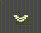

# Awake

Cross-platform (tested on Mac) app that prevents system from sleeping.



## Install

Download the latest release from [GitHub Releases](https://github.com/Royserg/awake/releases/latest).

On macOS, if you see a message that the app is "broken" or can't be opened, run this command to remove it from quarantine:

```bash
xattr -cr /Applications/Awake.app
```

## Features

- Toggle sleep prevention with a single click
- Visual indicator in system tray

## Usage

- Click the tray icon to toggle sleep prevention
- Right-click for the quit option

## Development

Built with:

- [Tauri](https://tauri.app/)
- Rust
